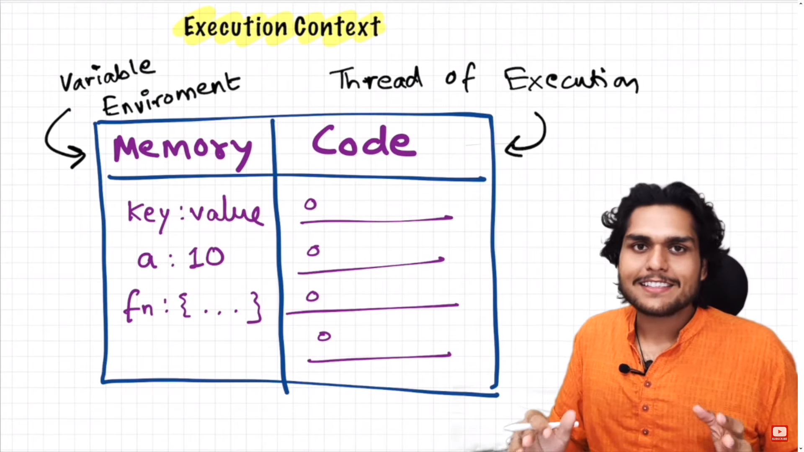

# How JavaScript Works

## Fundamental:
   - Excution Context:
      - Everything in javascript happens inside the excution context.
      - it can be visualized as a big box or container where JavaScript code is executed.

    
