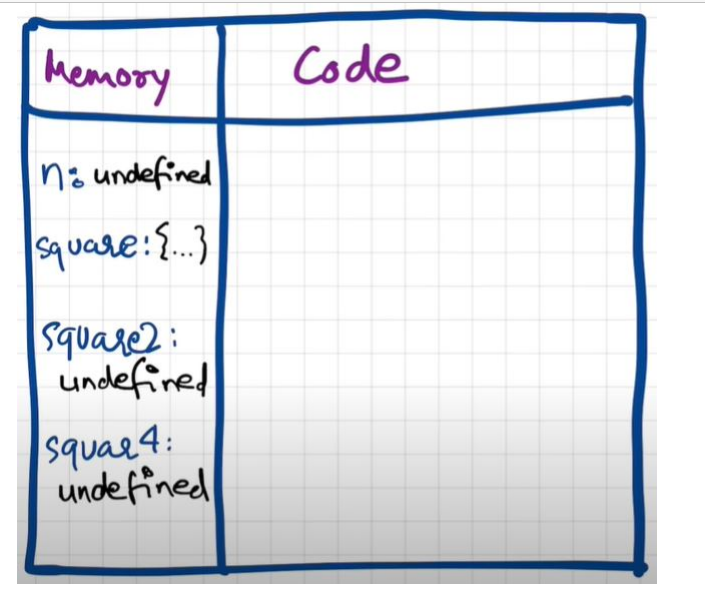
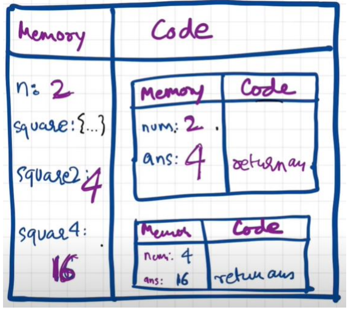

## How JavaScript Code is executed? & Call Stack

- Everytime you run a program, an execution context is created. When a variable or function is encountered, it is stored in the memory area.

```javascript
var n = 2;
function square(num) {
  var ans = num * num;
  return ans;
}
var square2 = square(n);
var square4 = square(4);
```

Now first, for this entire code a Global execution context is created.

### In the first phase (memory creation)

- Memory is allocated to variables and functions.
- For variable name(which is key) it assigns a value of undefined.
- For the function name(which is key) it assigns the entire function code as value.



```javascript

n:undefined
square:{...entire-code...}
square2:undefined
square4:undefined

```

### In the second phase (code execution)

- The variable name is replaced with its actual assigned value from code. So now n:2
- Skips over function code as there is nothing to assign there.
- We encounter a function call in square2. So a brand new local EC is created inside the code part of the global EC and this will have the same 2 components: Memory and Code.
- In the local EC, ans and num are both undefined (in the first phase). Then, the n value in global EC is passed to num, replacing undefined. num is the parameter and n is the argument.
- ans = num\*num (calculated in code part of local EC and returned) replaces undefined in local EC (memory part) and the final value is returned from local EC and is assigned to square2 var in global. After returning, local EC is removed from global EC.
- when the return keyword is encountered or the program reaches the end of the line, it returns the control of the program where it was invoked and the local EC is deleted.
- One more fun. call is met. Same thing happens here. Once square4 value is replaced from undefined to 16, global EC will also be deleted.

To manage all these EC, a call stack is created. Everytime code is run, the EC is pushed in. So first global EC is pushed. Then e1 EC(for square2) is pushed, and then after value returned, is popped. Similarly, e2 EC(for square4) is pushed, and then popped and finally Global is also popped and the stack is empty.

#### Call Stack maintains the order of execution of execution contexts


