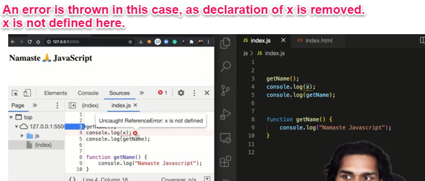
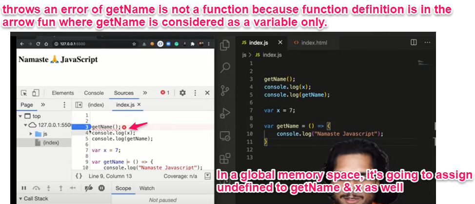
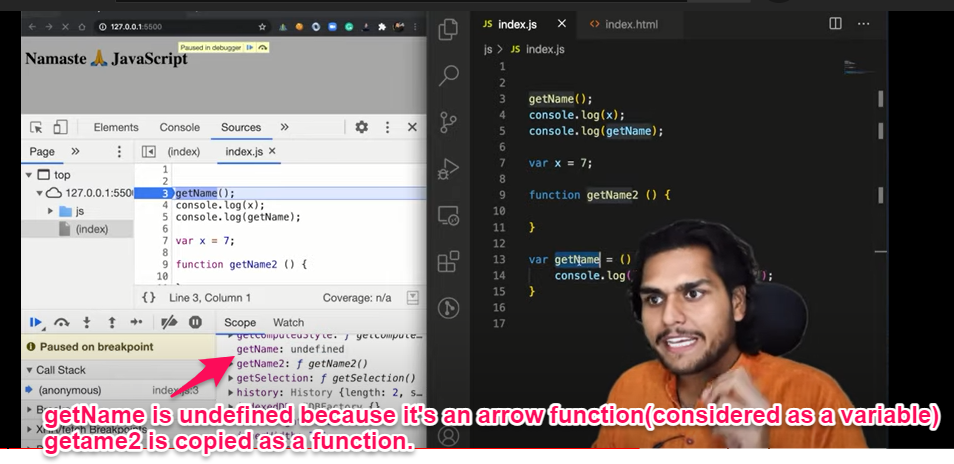
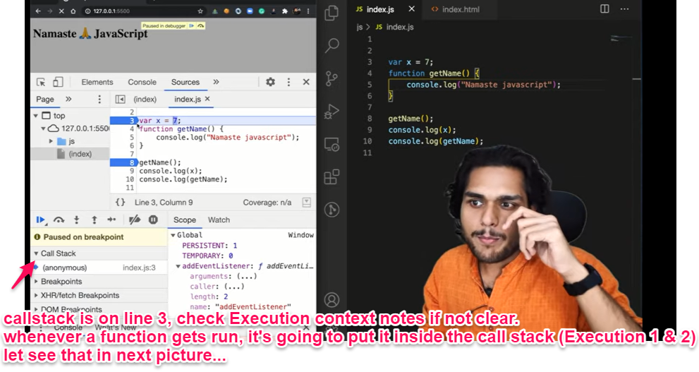

## Hoisting in JavaScript

Hoisting is a concept that enables us to extract values of variables and functions even before initialising/assigning value without getting errors. This happens due to the 1st (memory creation phase) of the Execution Context.

### Example 1:

```javascript
getName(); // Namaste Javascript
console.log(x); // undefined
var x = 7;
function getName() {
  console.log("Namaste Javascript");
}
```

### Output 1:

```javascript

Namaste Javascript
undefined

```

### Explanation:

- In many other programming languages, accessing something that hasn't been created (defined) would result in an outright error.
- However, in JavaScript, during the memory creation phase, it assigns 'undefined' to variables and allocates memory for functions.
- During execution, JavaScript executes whatever is asked of it.
- However, if a variable is removed or accessed before it's declared and not initialized, it will result in an error like Uncaught ReferenceError: x is not defined.

So in Episode 2, we learned that execution context gets created in two phases, so even before code execution, memory is created so in the case of a variable, it will be initialized as undefined while in the case of function the whole function code is placed in the memory.

### Example 2:

```javascript
getName(); // Namaste Javascript
console.log(x); // undefined

function getName() {
  console.log("Namaste Javascript");
}
```

### Output 2:

```javascript

  Uncaught ReferenceError: x is not defined at <anonymous>:2:17

```

### Let's remove the declaration of 'x' variable & see what happens



### Hoisting through Arrow Function

- In the Arrow function, it's considered a variable instead of a function.

### Example 3:

```javascript
getName(); // Namaste Javascript
console.log(x); // undefined

var getName = () => {
  console.log("Namaste Javascript");
};
```

### Output 3:

```javascript

  Uncaught TypeError: getName is not a function at <anonymous>:2:5

```








### REASON OF WEIRDNESS

- The answer lies in the Global Exection Context. In the memory creation phase, the variables will be initialized as undefined and functions will get the whole function code in their memory.
- This is the reason why we are getting these outputs.
