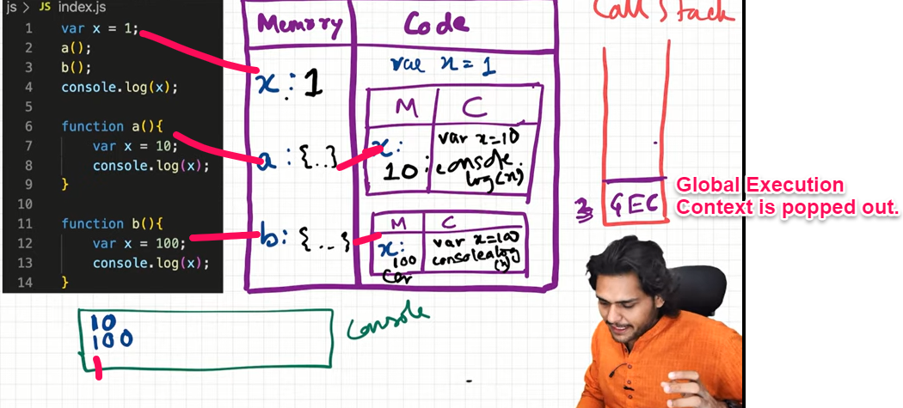

## Functions and Variable Environments

### Example 1:

```javascript
var x = 1;
a(); //10
b(); //100
console.log(x);

function a() {
  var x = 10;
  console.log(x);
}

function b() {
  var x = 100;
  console.log(x);
}
```

### Let's see the Explanation

Code Flow in terms of Execution Context:

- When we run our code, a big box called the Global Execution Context (GEC) is created. It has two parts: Memory and Code.Global Execution Context (GEC):

### Global Execution Context (GEC):

- GEC is pushed into the Call Stack, which keeps track of where we are in our code.

### First Phase of GEC:

- In the first phase, called the memory phase, variables like x are set to undefined, and functions like a and b have their entire code saved as their value.

### Second Phase of GEC:

- In the second phase, called the execution phase, when a function is called, like a(), a new local Execution Context is created inside the GEC.

### Local Execution Context:

- Inside this local Execution Context, a new x variable is created, also set to undefined.
- Then, x is assigned the value 10 and printed in the console log.
- After printing, since there are no more commands to run, the local Execution Context for a() is removed from both the GEC and the Call Stack.

### Back to b() Function Call:

- The cursor goes back to the b() function call, and the same steps repeat.

### Call Stack:

- The Call Stack keeps track of our progress: [GEC, b()] -> GEC after printing yet another x value as 100 in the console log.

### End of Program:

- Finally, when everything is done, the GEC is deleted, and it's removed from the Call Stack. The program ends.




### Output 1:

```javascript
10;
100;
1;
```
